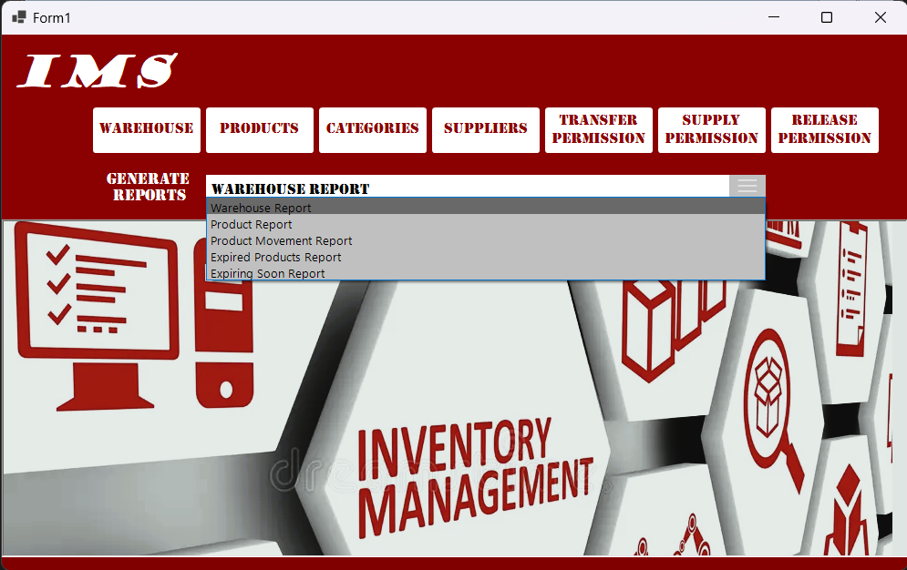
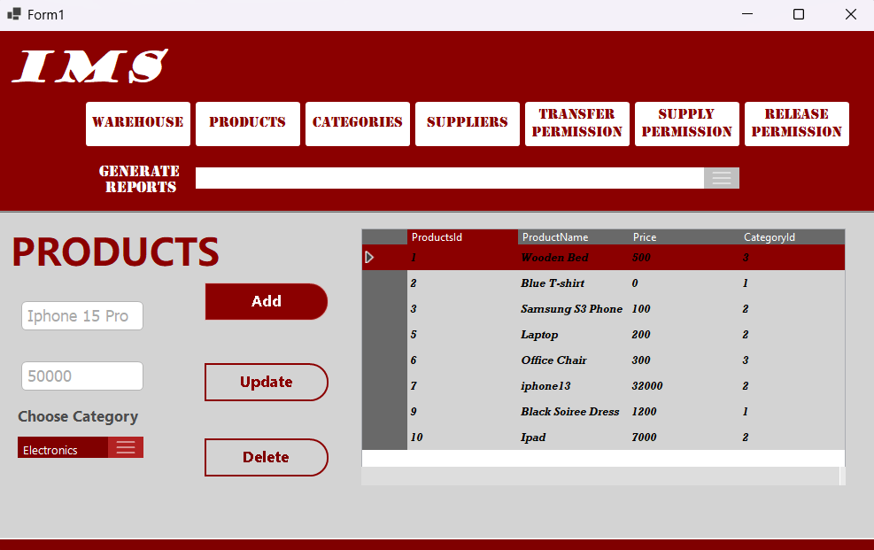
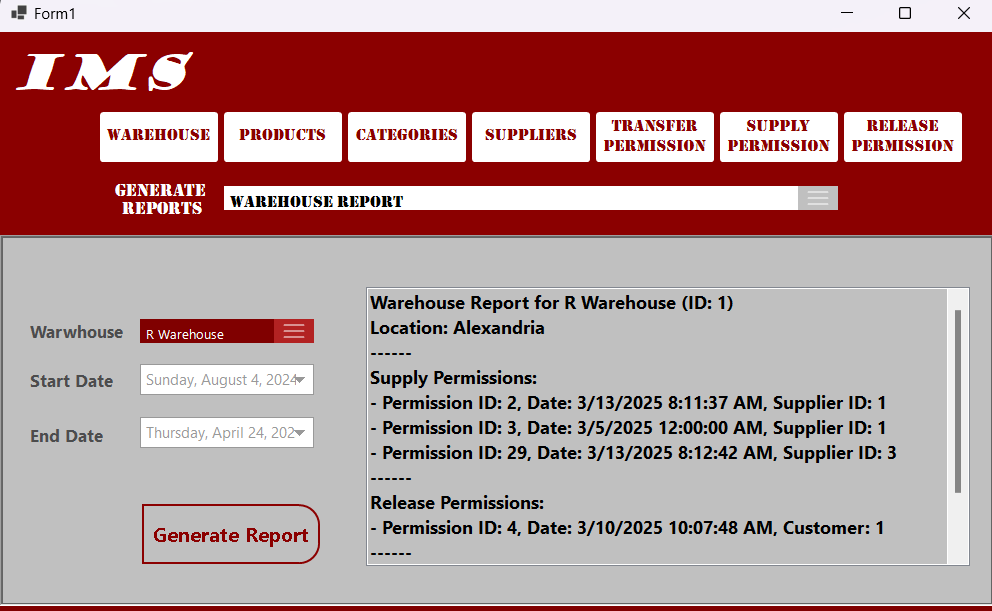
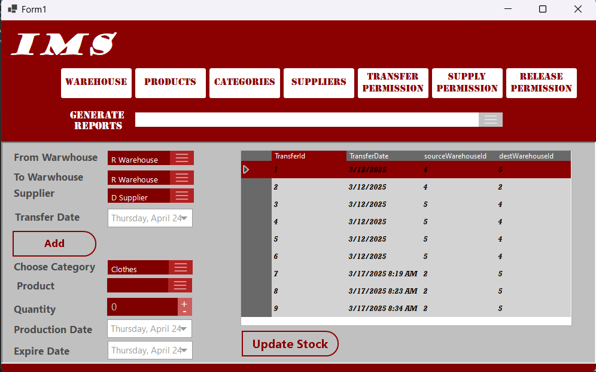

# 📦 Warehouse Inventory Management System

A robust inventory management desktop application developed with **C#**, **Entity Framework Core**, and **Windows Forms**, designed to efficiently manage warehouses, products, and all inventory operations including supply, release, and transfer activities.

---

## 📸 Application Screenshots

### 🖥️ Dashboard

### ➕ Add Product

### 📊 Generating a Report for Warehouse

### 🔁 Adding a Transfer Permission

---

## 🚀 Features

### 🔹 Warehouse Management
- Add, edit, and delete warehouse details
- View a centralized list of all warehouses

### 🔹 Product Management
- Add, edit, and manage products with supplier associations
- Track stock levels per warehouse and per supplier

### 🔹 Supply & Release Permissions
- Issue supply permissions to warehouses from suppliers
- Handle product releases from warehouses to customers
- Filter permissions by date range

### 🔹 Transfer Operations
- Transfer products between warehouses
- View and manage all transfer transactions

### 🔹 Reports Module
Generate insightful reports including:

- **Warehouse Report**: View stock, supply, and release history of a specific warehouse
- **Product Report**: See item movement and availability across warehouses
- **Product Movement Report**: Analyze all inventory movement (supply, release, transfer) in a time period
- **Expired Products Report**: Track items that exceeded their shelf life
- **Expiring Soon Report**: Monitor products approaching expiration

> All reports support optional filtering (date range, warehouse ID) and are displayed using intuitive DataGridViews.

---

## 🛠️ Technologies Used

- **C# .NET Framework**
- **Windows Forms**
- **Entity Framework Core (Code First)**
- **SQL Server**
- **LINQ**

---

## 📁 Project Structure

